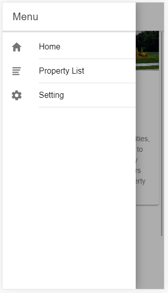
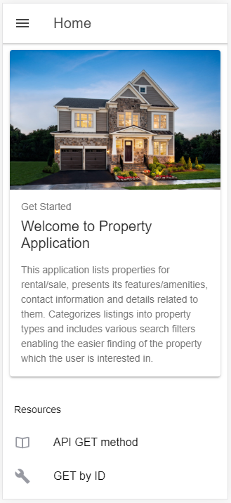
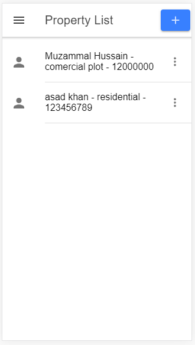
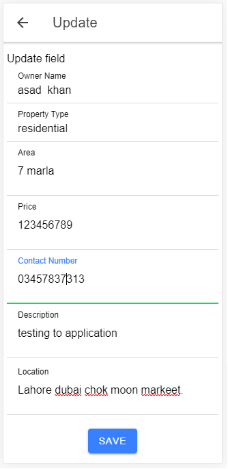
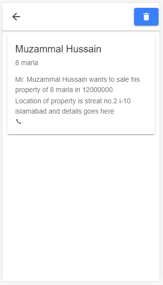
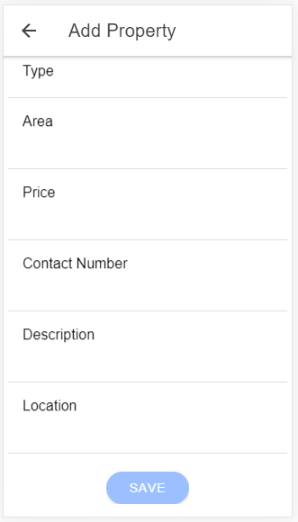
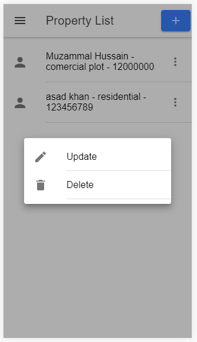

# A property deade application with have following.
<h3>Frontend Work</h3>
Tools and technologies  
•	Hybrid Application, where Ionic framework and angular used for front-end. 
•	Firebase/mongo dB database and node.js will be used for backed work. 

Features in our Application.
1.	Customer’s registration  
•	Customer will be able to create new account. 
•	Sign in and forgot password options will also be provided. 

2.	Dealer registration  
•	New can will be able to the application.  
•	Sign in and forgot password options will also be provided.  

3.	Admin registration  
•	There is functionality to add new administration to the system. 
•	Sign in and forgot password options will also be provided.  

4.	Customers Dashboard  
•	Customer will be able to view list of property with details.  
•	After viewing the different properties, Customer will be able to contact with the property dealer and can fix the rate etc.

5.	Admin Dashboard  
•	Admin will able to manage (CRUD) the records of users.  
•	Users will able to contact with admin.

6.	Dealer Dashboard  
•	Dealer will able Add new property for sale.  
•	Dealer will able to remove the soled property.  
•	Dealer can update information of the property if there is an error while entering the data.

<h3>For backend work please follow the link <a href = "https://github.com/MuzammalHussain6313/firstnodejsapp">https://github.com/MuzammalHussain6313/firstnodejsapp</a></h3>
<h4>Screen shorts.</h4>

Menu.
 

Home.
 

List of Property.
 

Update Item
 

details
 

Add new Item
 

Delete popover.
 

